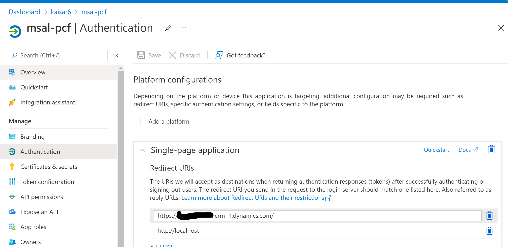

# Elvisio Authentication Result Generator
This is the code for the Power App Component Framework code for **Elvisio Authentication Result Generator**. Once setup correctly, this field type PCF will show the logged in user's `MSAL`'s authentication result object in the form. User can copy the whole authentication result object, the access or id token if need be. 

## Setup
### Application Registration Creation
Setting up application registration is discussed in this [MS Documentation](https://docs.microsoft.com/en-us/azure/active-directory/develop/quickstart-register-app) 

Once the appregistion is created go to **Authentication** section of the app registration and add a **Platform** as single page application. One of the Redirect URIs has to be the Dynamics 365 instance in which you want to deploy the control in.

 

## Usage
### Setting up the Control
 - The managed version of the solution can be found on the [release folder](https://github.com/ImranCodeBug/codebug-jwt-generator/releases/tag/v1.0) of this repository. Please download the zip file and install the solution.
 - Once the solution is installed go to any form property and find a text type field for which you want to replace the PCF with and go to **Field Properties > Controls**. Click on **Add Control** and find **Azure Authentication Result** control. 
 - Add `ClientId`, `TenantId`, `RedirectUrl` fields according to the application registration. 
 - Press **OK** in form and **Save** and **Publish** the form

### Using the control

> Make sure your browser allows popup from Dynamics web site. otherwise the PCF wont work.

Open the form and you should see the `AuthenticationResult` object is appearing in the control.

You should be able to copy the whole object (Formatted JSON) or just copy the Id or Access token from the object.

